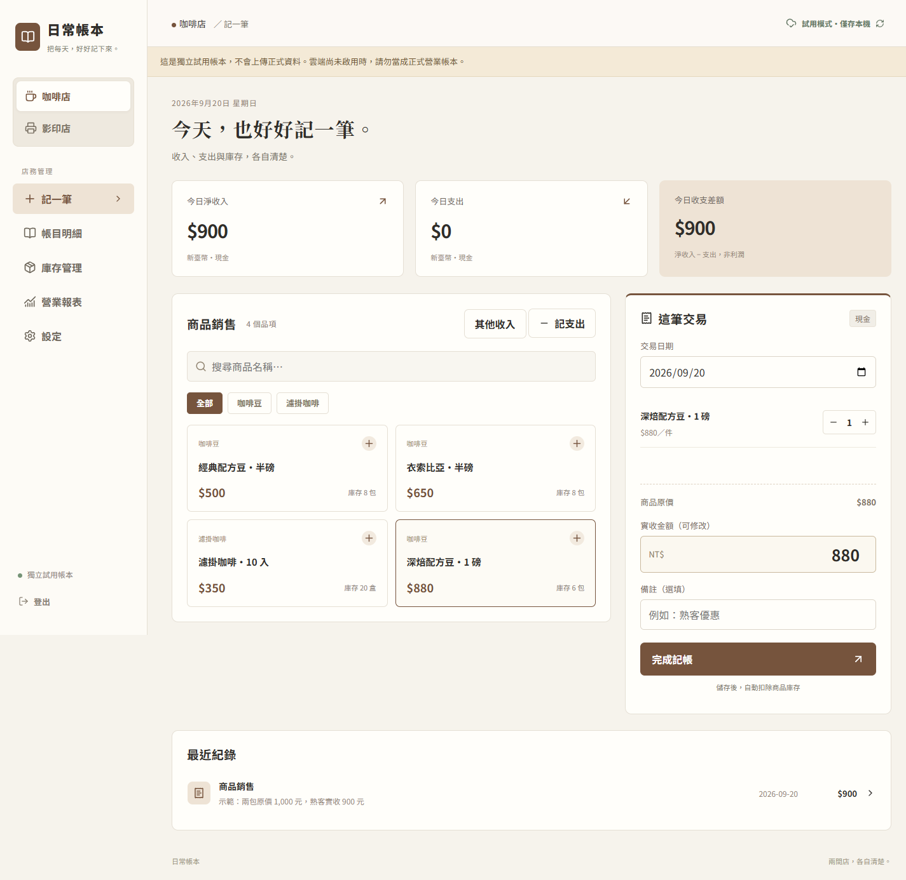
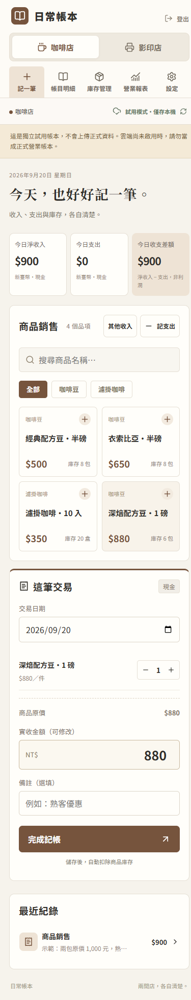
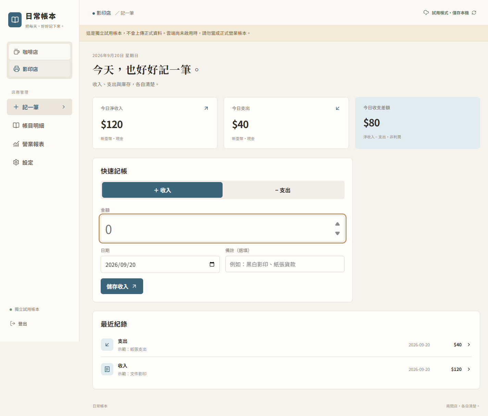

<div align="center">

# 日常帳本 · Everyday Ledger

**兩間店，各自清楚。斷網時，也能把今天記下來。**

An offline-capable ledger for the small shops that keep a family going.

[繁體中文](#繁體中文) · [English](#english) · [線上試用 / Live demo](https://hou96150.github.io/everyday-ledger/) · [設計過程 / Design story](docs/DESIGN.md)

[](https://github.com/hou96150/everyday-ledger/actions/workflows/ci.yml)
[](https://github.com/hou96150/everyday-ledger/actions/workflows/demo.yml)



</div>

## 繁體中文

### 從家裡的兩間店開始

家裡同時經營咖啡店與影印店，卻不需要兩套一樣複雜的系統。咖啡豆有規格、售價與庫存；影印店只想快速記下一筆收入、支出和備註。兩間店的帳要分開，打烊時又想看合計。

日常帳本就是從這個需求做出來的：**咖啡店按商品記錄，影印店按金額記錄，同一個畫面切換。** 它是一個持續開發中的小店記帳工具，也是一份完整公開的產品設計與離線同步實作案例。

### 先花 1 分鐘試試

[開啟公開試用版 →](https://hou96150.github.io/everyday-ledger/)

1. 畫面會載入示範商品。點一包咖啡豆，調整「實收金額」，完成記帳。
2. 到「庫存管理」看數量變化，再切換「影印店」記一筆收入與備註。
3. 在「營業報表」選兩店合計，匯出 Excel。

**不用註冊。試用資料僅存在你的瀏覽器，不連接家庭帳本或任何 Supabase 專案。** 頁面重新整理後會保留你在同一瀏覽器的修改；清除該網站資料便會清除試用紀錄。示範交易使用首次開啟時的日期，隔天可調整報表日期查看。

### 適合誰用？

| 使用者                             | 可以解決的事                                                      |
| ---------------------------------- | ----------------------------------------------------------------- |
| 家庭經營的咖啡店、零售小店         | 商品規格分開管理，銷售數量、庫存與實收金額一起記                  |
| 同時管理商品店與服務店的人         | 一邊要庫存，一邊只要簡單收支，各用適合的操作流程                  |
| 想從紙本或零散試算表開始數位化的人 | 用手機、平板或電腦記帳，再匯出 Excel 查帳                         |
| 想研究離線網頁與資料一致性的開發者 | 讀取 IndexedDB、待同步佇列、版本衝突、PostgreSQL 權限的實作與測試 |

目前固定為兩種店面流程，可修改店名；還不能自由新增第三間店。介面為繁體中文，幣別為新臺幣，營業日期以台灣時區計算。

### 做得到什麼？

| 日常情境                       | 帳本怎麼處理                                         |
| ------------------------------ | ---------------------------------------------------- |
| 一包豆有半磅、1 磅等規格       | 各規格建立獨立品項、售價與期初庫存                   |
| 原價 1,000 元，熟客實收 900 元 | 保留商品與數量，另外輸入實收金額                     |
| 補進 5 包，月底才付貨款        | 進貨增加庫存；實際付款時另外記支出                   |
| 送人、耗用、報廢或盤點         | 記錄庫存異動與原因，不自動當成收入或支出             |
| 客人只退其中 1 包              | 關聯原銷售，記部分退款，選擇是否回補庫存             |
| 昨天金額打錯                   | 修改或作廢，保留前後紀錄供查核                       |
| 店內短暫斷網                   | 已開啟、登入過的裝置先存本機，連線後在網站開啟時同步 |
| 兩台裝置同時改同一筆           | 提示版本衝突，由使用者核對後決定                     |
| 打烊要整理兩店                 | 日期範圍、單店／合計、銷售數量與 `.xlsx` 匯出        |

<details>
<summary>看手機畫面與影印店流程</summary>





</details>

### 為什麼這樣設計？

- **把兩種工作分開。** 咖啡商品銷售需要數量；影印收入不必每次先選商品。
- **把現金與庫存分開。** 貨到了不代表已付款；送人也不代表收到錢。
- **先保存，再同步。** 一筆已儲存的紀錄不應因為短暫斷網而消失。
- **讓修改看得見。** 金額修正有歷史，同筆衝突不靜默覆蓋。
- **少一個家人使用障礙。** 自架版使用一組家庭共用帳號與密碼，不要求每位家人有信箱；相對地，歷史無法辨識是哪一位家人操作。

完整的需求整理、決策理由、畫面設計、實作順序與取捨，見 [設計紀錄](docs/DESIGN.md)。

### 本機啟動

需要 Node.js 24 與 npm。Windows PowerShell 如遇腳本執行限制，將 `npm` 改為 `npm.cmd`。

```bash
git clone https://github.com/hou96150/everyday-ledger.git
cd everyday-ledger
npm ci
npm run dev
```

開啟終端顯示的網址，選「開啟獨立試用帳本」。不設定環境變數即可使用空白本機試用帳本。

若要和公開試用版一樣自動載入示範資料，在 `.env.local` 寫入：

```dotenv
VITE_PUBLIC_DEMO=true
```

要使用自己的雲端帳本，依 [自行部署指南](docs/SELF_HOSTING.md) 建立獨立 Supabase 專案、設定單次開通碼及部署前端。公開試用站不接受家庭帳號註冊。

### 技術與驗證

React + TypeScript + Vite；Dexie / IndexedDB 保存裝置資料；Supabase Auth + PostgreSQL 處理登入與雲端帳務；ExcelJS 產生 Excel；PWA 快取網頁；GitHub Pages 提供無後端試用版。

```bash
npm test
npm run build
npm run preview
```

目前有 **29 個自動測試**，涵蓋收支、庫存、退款、版本衝突、重送防重複、RLS／直接寫表拒絕、本機持久化與公開試用隔離。SQL 測試在 PGlite 的 PostgreSQL 引擎執行；它不等同於完整 Supabase 平台測試。

原始部署也曾完成真實 Supabase API、瀏覽器離線重開、Excel 匯出後重新讀取與手機版面驗證。這些是開發驗證，**不代表已完成長期店內營運驗收或外部安全稽核**。見 [驗證與限制](docs/VERIFICATION.md)、[架構](docs/ARCHITECTURE.md)。

### 目前的邊界

- 收支差額不是利潤；尚無成本攤提、應收應付、稅務申報、支付串接或完整 POS 功能。
- 沒有員工角色、個人操作歸屬、多幣別、跨家庭 SaaS 或任意店面數量。
- 離線功能需先在裝置載入網站；雲端帳本需先連網登入並同步。關閉網站不保證背景同步。
- 庫存不足會提示但允許確認後登記，之後需補登或盤點。跨裝置同時銷售不是強制庫存預留。
- 瀏覽器可能清除裝置儲存；Excel 是查帳匯出，不是完整可還原備份。
- 無信箱的帳號不提供寄信重設密碼；管理者需在後端安全重設。
- 依賴項仍有已記錄的 moderate 安全通報，見 [SECURITY.md](SECURITY.md)。

### 接下來與參與方式

近期優先：完整備份／還原、帳號維護、兩台真實裝置的店內驗收、鍵盤與輔助使用體驗。見 [Roadmap](docs/ROADMAP.md)。

歡迎用 [Issue](https://github.com/hou96150/everyday-ledger/issues/new/choose) 分享你的店務情境、重現錯誤或提出改善；請用假資料，不要貼客戶或帳務秘密。貢獻方式見 [CONTRIBUTING.md](CONTRIBUTING.md)。

如果這個專案對你有用，歡迎給一顆 **Star**，或分享給正在管理小店的人。實際的使用回饋，也能幫助下一版做對事情。

授權狀態見 [授權說明](docs/LICENSING.md)。

---

## English

### Built around two family shops

A coffee shop and a print shop share a family, but not the same bookkeeping workflow. Coffee beans need variants, prices, sales quantities and stock. Printing work often needs only an amount and a short note. Their ledgers should stay separate while still offering a combined daily view.

Everyday Ledger turns that situation into a small, working product: **record coffee sales by item, record printing by amount, and switch between the two in one interface.** It is an actively developed shop ledger and a public case study in product decisions and offline synchronization.

### Try it in a minute

[Open the public demo →](https://hou96150.github.io/everyday-ledger/)

1. Choose a sample coffee product, edit the amount actually received, and save a sale.
2. Check the inventory change. Switch to the print shop and record income with a note.
3. Open reports, select both shops, and export an Excel workbook.

**No signup. Demo records stay in your browser; there is no connection to a household backend or any Supabase project.** Reloads preserve your edits on that browser. Clearing site data removes them. Sample transactions use the date of the first visit; adjust the report range when returning on a later day.

### Who is it for?

| Audience                                                       | What it helps with                                                                        |
| -------------------------------------------------------------- | ----------------------------------------------------------------------------------------- |
| Family coffee shops and small retailers                        | Track product variants, quantities, actual receipts and stock together                    |
| People running a retail shop and a service shop                | Use inventory where needed and simple cash entries elsewhere                              |
| Small businesses moving beyond paper or scattered spreadsheets | Enter records on a phone, tablet or computer; review them in Excel                        |
| Developers studying offline web apps                           | Explore IndexedDB, an outbox, version conflicts, PostgreSQL authorization and their tests |

The current product has two fixed shop workflows with editable names, not an arbitrary number of stores. Its interface is Traditional Chinese; amounts are TWD and business dates use Asia/Taipei.

### Daily workflows

| Situation                                    | Behavior                                                                                    |
| -------------------------------------------- | ------------------------------------------------------------------------------------------- |
| Different sizes of the same coffee           | Separate items, prices and opening stock                                                    |
| List price is 1,000; the customer pays 900   | Preserve quantities and enter the actual receipt                                            |
| Five bags arrive before the supplier is paid | Purchase adds stock; a separate expense records payment                                     |
| Gifts, usage, spoilage and stock counts      | Record a reason and inventory movement without inventing cash flow                          |
| One item from a larger sale is returned      | Link a partial refund to the sale; choose whether to restock                                |
| A previously entered amount is wrong         | Edit or void it while preserving before/after history                                       |
| Connectivity drops                           | Previously loaded, signed-in devices save locally and sync while the app is open and online |
| Two devices change the same record           | Show the version conflict for explicit review                                               |
| End-of-day review                            | Date filters, per-shop or combined reports, quantities sold and `.xlsx` export              |

### Design choices

Item sales and simple cash entries have different interfaces. Inventory movements and payments remain separate. Local persistence happens before synchronization. Edits have history, and conflicts do not silently overwrite another version. One shared household username/password avoids requiring real email accounts, but also means history cannot identify individual family members.

Read the bilingual [design story](docs/DESIGN.md) for the requirements, interface direction, build sequence and tradeoffs. Screenshots above contain synthetic data only.

### Run locally

Use Node.js 24 and npm. On Windows, use `npm.cmd` if PowerShell blocks npm scripts.

```bash
git clone https://github.com/hou96150/everyday-ledger.git
cd everyday-ledger
npm ci
npm run dev
```

Open the printed local URL and choose **開啟獨立試用帳本** (open independent demo). No environment variables are required for an empty local demo. For the prefilled public-demo experience, put `VITE_PUBLIC_DEMO=true` in `.env.local`.

For your own cloud ledger, follow [Self-hosting](docs/SELF_HOSTING.md): create a separate Supabase project, issue a one-time setup code, and deploy the frontend. The public demo does not register households.

### Stack and verification

React, TypeScript and Vite; Dexie / IndexedDB for device storage; Supabase Auth and PostgreSQL for identity and cloud records; ExcelJS for exports; PWA caching; GitHub Pages for the backend-free demo.

```bash
npm test
npm run build
npm run preview
```

**29 automated tests** cover bookkeeping, inventory, refunds, version conflicts, idempotent retries, RLS/direct-write rejection, local persistence and public-demo isolation. SQL runs in PGlite's PostgreSQL engine; this is not a substitute for testing the full Supabase platform.

The original development deployment also passed real Supabase API checks, browser offline reloads, workbook export/reopening and mobile layout checks. These are development results, **not long-term shop acceptance or an independent security audit**. See [Verification](docs/VERIFICATION.md) and [Architecture](docs/ARCHITECTURE.md).

### Current limits

- Cash-flow balance is not profit. No cost accounting, receivables/payables, tax filing, payment processing or full POS.
- No employee roles, individual operator attribution, multiple currencies, cross-household SaaS or arbitrary store counts.
- Offline use requires an earlier page load; cloud accounts need an earlier online login/sync. Background sync after closing the app is not guaranteed.
- Negative stock prompts for confirmation but is permitted for later reconciliation. Concurrent sales do not reserve stock across devices.
- Browsers can evict local data. Excel exports are not restorable database backups.
- There is no email-based password recovery; administrators must reset credentials through a trusted backend.
- Dependencies have documented moderate advisories; see [Security](SECURITY.md).

### Next steps and contributing

Priorities are restorable backups, account maintenance, real two-device shop acceptance, and keyboard/accessibility improvements. See the [roadmap](docs/ROADMAP.md).

Share a shop scenario, reproducible bug, or focused improvement through [Issues](https://github.com/hou96150/everyday-ledger/issues/new/choose). Use fictional data and never post customer information or credentials. See [Contributing](CONTRIBUTING.md).

If this helps you, a **Star** or a recommendation to another small-shop owner is appreciated. Concrete feedback helps shape the next release.

See [licensing status](docs/LICENSING.md) for reuse terms.
