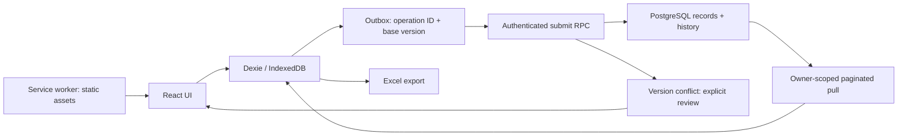

# 架構 / Architecture

[README](../README.md) · [自架 / Self-hosting](SELF_HOSTING.md)

## 繁體中文

### 資料與目錄

| 位置                                 | 責任                                             |
| ------------------------------------ | ------------------------------------------------ |
| `src/domain.ts`                      | 品項、交易、庫存差額、收支統計與輸入規則         |
| `src/storage.ts`                     | 按帳號隔離的 IndexedDB、歷史、outbox、同步與衝突 |
| `src/App.tsx`                        | 店面切換、銷售、快速收支、庫存、明細、報表、設定 |
| `src/Auth.tsx`                       | 家庭登入、首次設定、過期後重新驗證               |
| `src/export.ts`                      | 6 張工作表的 Excel 匯出                          |
| `src/demo.ts`                        | 只在公開試用模式使用的虛構資料                   |
| `supabase/schema.sql`                | 帳本資料表、RLS、提交函式與伺服器規則            |
| `supabase/setup.sql`                 | 單次開通碼雜湊、鎖定與授權會員建立               |
| `supabase/functions/setup-household` | 伺服器端首次帳號建立                             |

`ledger_accounts` 是可使用帳本的帳號名單；`ledger_records` 以 `product / entry / settings` 儲存有版本的資料；`ledger_history` 記錄操作、請求與前後內容。庫存由期初量和有效交易推算，不依靠 UI 直接改一個累積數字。退款連結原單，作廢交易不計入庫存與收支。

### 從儲存到同步

一次本機儲存會在 IndexedDB transaction 內寫入資料、歷史與有順序的待送操作。每次操作有唯一 ID 與所依據的版本。伺服器在同一資料庫交易內取得帳號鎖、查授權與重送、確認版本、驗證規則、更新資料及歷史。

同一 ID 與相同請求重送時回傳既有結果，避免網路回應遺失後重複入帳。舊版本修改回傳衝突，而不是直接覆蓋。核對後重送仍檢查版本；若遠端又改了，必須再核對。盤點的數量前提改變時需要重新盤點。

同步會按頁拉回當前帳號資料。網站開啟時約每 30 秒、恢復連網或回到頁面時嘗試同步；這不是永遠在背景運作的服務，也不是無衝突合併的 CRDT。

### 權限與試用邊界

一般帳號僅能透過 RLS 讀自己的紀錄，不能直接寫表。公開 RPC 是 security invoker wrapper；私有 schema 的 definer 函式明確檢查 `auth.uid()` 與授權名單。前端只使用 publishable key。首次開通函式的管理權限只留在伺服器。

公開試用建置設定 `VITE_PUBLIC_DEMO=true`，即使誤給雲端環境變數也不建立 Supabase client。示範資料只在空白試用資料庫植入一次，不覆蓋使用者修改，也不建立上傳操作。PWA 快取靜態檔案；帳務資料在 IndexedDB。共享同一瀏覽器設定檔的人可能讀取本機資料，本機未提供額外加密。

## English

### Data and source map

`domain.ts` contains types, amounts, stock arithmetic and validation. `storage.ts` owns account-separated IndexedDB databases, history, the ordered outbox and conflict resolution. `App.tsx` contains the five main screens; `Auth.tsx` handles household setup/login/reauthentication. `export.ts` creates six worksheet exports. `demo.ts` supplies synthetic records only in public-demo mode. The SQL files define ledger authorization and bootstrap state; the Edge Function creates the first household account.

`ledger_accounts` explicitly grants ledger membership. `ledger_records` stores versioned products, entries and settings. `ledger_history` stores operations, requests and before/after values. Inventory is derived from opening quantities and effective transactions. Refunds reference the original sale; voided entries do not affect cash or stock.

### Save and synchronize

A single IndexedDB transaction writes local records, history and an ordered upload operation. Each operation includes a unique ID and the version it was based on. In a database transaction, the server takes an account lock, checks identity/membership and duplicate operations, checks the version, validates business rules, and updates records/history.

The same operation ID and request return the previous result on retry, preventing duplicate entries after a lost response. Stale versions return a conflict. A resolved conflict is version-checked again; another remote edit requires another review. Stock counts must be repeated when their expected quantity changes.

Owner-scoped records are pulled in pages. Sync is attempted about every 30 seconds while the app is open, on reconnect and when the page becomes visible. This is neither a permanent background service nor conflict-free CRDT merging.

### Authorization and demo isolation

RLS permits reading the current owner's records, while direct table writes are denied. The public RPC is a security-invoker wrapper around a private-schema definer function with explicit `auth.uid()` and membership checks. Browsers use a publishable key; bootstrap administrative credentials stay on the server.

`VITE_PUBLIC_DEMO=true` prevents constructing a Supabase client even when cloud variables are present. Synthetic data is inserted once into an empty demo database, without overwriting edits or enqueuing uploads. The service worker caches static files; ledger data lives in IndexedDB. Other people sharing the browser profile may access local data, which is not additionally encrypted.
